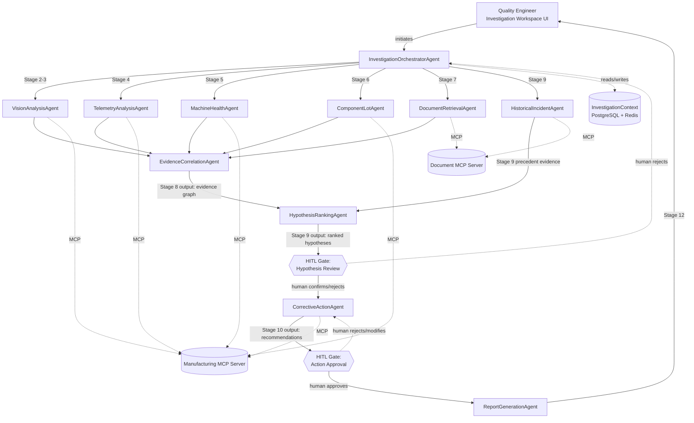

# Agent Topology — ForgeSight AI

## 1. Agent Boundary Discovery

### 1.1 Method

Agent boundaries are derived from software capabilities required by the 12-stage investigation workflow, not from the 7 human personas. The question asked for each capability cluster is: "Is this a distinct, reusable cognitive/data-gathering capability that other stages might also need, or is it a one-off step best left inline in the orchestrator?"

### 1.2 Capability Cluster Analysis

| Capability Cluster | Decision | Rationale |
|---|---|---|
| Image retrieval & CV inference | → **Agent** (`VisionAnalysisAgent`) | Distinct model-backed capability (CV inference), reusable across Stage 3 and re-verification at Stage 11 |
| Telemetry retrieval & anomaly detection | → **Agent** (`TelemetryAnalysisAgent`) | Requires domain-specific anomaly logic (deviation from qualified process windows), not a pure passthrough of MCP data |
| Maintenance record retrieval & machine health assessment | → **Agent** (`MachineHealthAgent`) | Combines raw MCP data with wear-threshold reasoning (per SOP-MAINT-017); more than a passthrough |
| Component lot retrieval & supplier history correlation | → **Agent** (`ComponentLotAgent`) | Carries the mandatory supplier-safety wording constraint; needs dedicated logic to avoid overclaiming |
| SOP/manual RAG retrieval | → **Agent** (`DocumentRetrievalAgent`) | Wraps the Document MCP Server + query construction logic (Phase 4/5) |
| Historical incident semantic search | → **Agent** (`HistoricalIncidentAgent`) | Distinct retrieval target and output shape (incidents, not document passages) from `DocumentRetrievalAgent` |
| Multi-source evidence correlation & synthesis | → **Agent** (`EvidenceCorrelationAgent`) | Core cross-domain reasoning step — must remain a distinct capability, not folded into the orchestrator |
| Root-cause hypothesis ranking | → **Agent** (`HypothesisRankingAgent`) | Distinct LLM-reasoning capability consuming the evidence graph; separated from correlation to keep each agent single-purpose |
| Corrective action recommendation | → **Agent** (`CorrectiveActionAgent`) | Distinct output type (recommended actions) with its own HITL gate, separate from hypothesis ranking |
| Human approval gate coordination | → **Workflow mechanism**, not an agent | This is state-machine logic owned by the Orchestrator (Section 2), not a cognitive capability |
| Report generation | → **Agent** (`ReportGenerationAgent`) | Distinct compilation/formatting capability, reusable at Stage 12 regardless of investigation outcome |
| Audit event logging | → **Cross-cutting service call**, not an agent | Every agent and MCP tool call already emits `AuditEvent`s (Phase 5 Section 4.3); a dedicated agent would only add indirection |

### 1.3 Resulting Agent Set (11 Agents + 1 Orchestrator)

1. `InvestigationOrchestratorAgent`
2. `VisionAnalysisAgent`
3. `TelemetryAnalysisAgent`
4. `MachineHealthAgent`
5. `ComponentLotAgent`
6. `DocumentRetrievalAgent`
7. `HistoricalIncidentAgent`
8. `EvidenceCorrelationAgent`
9. `HypothesisRankingAgent`
10. `CorrectiveActionAgent`
11. `ReportGenerationAgent`

### 1.4 Per-Agent Boundary Summary

| Agent | Responsibility | Explicitly Does NOT | Inputs | Outputs | MCP Tools Invoked | Output Risk Level | Stages Served |
|---|---|---|---|---|---|---|---|
| `InvestigationOrchestratorAgent` | Sequences specialist agents, maintains `InvestigationContext`, routes to HITL gates | Perform any domain analysis itself; approve anything | Incident ID | Stage transitions, agent dispatch | None directly | N/A (control-plane) | All (1–12) |
| `VisionAnalysisAgent` | Retrieves AOI evidence and CV findings for a board | Diagnose root cause; correlate with other domains | `board_id` | `CvFinding` list with provenance | `get_board_inspection_data` | Low | 2, 3 |
| `TelemetryAnalysisAgent` | Retrieves telemetry and flags parameter deviations against qualified windows | Conclude root cause from telemetry alone | `machine_id`, `batch_id`, time window | Telemetry series + flagged deviations | `get_production_telemetry` | Low | 4 |
| `MachineHealthAgent` | Retrieves maintenance/nozzle history and assesses against wear thresholds (SOP-MAINT-017) | Authorize or schedule maintenance itself | `machine_id`, `nozzle_id` | Maintenance assessment + `recommend_preventative_maintenance` proposal | `get_machine_maintenance_history`, `recommend_preventative_maintenance` | Low (assessment) / Medium (recommendation) | 5, 10 |
| `ComponentLotAgent` | Retrieves lot/supplier history and reports statistical correlation only | State or imply supplier fault | `lot_number`, `part_number` | Lot statistics with mandated correlation-only wording | `get_component_lot_history` | Low | 6 |
| `DocumentRetrievalAgent` | Retrieves SOP/manual passages relevant to investigation context | Answer questions outside the approved corpus; fabricate citations | Investigation context (defect type, component, machine, stage) | `RetrievedPassage` list | `search_technical_sops`, `get_document_by_id` | Low | 7 |
| `HistoricalIncidentAgent` | Retrieves semantically similar closed incidents | Assert the current incident's root cause is the same as a past one | `defect_type`, `component_id` | Ranked list of similar incidents | `search_historical_incidents` | Low | 9 |
| `EvidenceCorrelationAgent` | Builds a cross-domain evidence graph linking CV, telemetry, maintenance, lot, and SOP evidence | Rank or select a single root-cause hypothesis | All specialist agent outputs for the incident | Evidence graph (linked, deduplicated, contradiction-flagged) | None directly (consumes prior agent outputs) | Medium (synthesis feeds hypothesis ranking) | 8 |
| `HypothesisRankingAgent` | Generates ranked root-cause hypotheses with supporting/contradicting evidence | Approve, sign off, or auto-execute any hypothesis | Evidence graph | Ranked `RootCauseHypothesis` list | None directly | Medium | 9 |
| `CorrectiveActionAgent` | Recommends corrective actions tied to top-ranked hypotheses | Execute any corrective action; issue a SCAR | Ranked hypotheses | `CorrectiveAction` recommendations | `recommend_preventative_maintenance` (when maintenance-related) | Medium | 10 |
| `ReportGenerationAgent` | Compiles final signed-off investigation into a structured report | Alter any prior evidence, hypothesis, or approval record | Signed-off incident state | `Report` document | None directly | Low (compilation of already-approved content) | 12 |

---

## 2. Agent Topology Diagram

### 2.1 Topology (Mermaid)

### 2.2 Orchestrator Definition: `InvestigationOrchestratorAgent`

**Role**: Receives an `incident_id`, sequences specialist agents according to the 12-stage workflow, persists `InvestigationContext` (Section 3 of `a2a-architecture.md`), and routes execution to HITL gates whenever a stage transition requires human sign-off.

**Decides:**
- Which specialist agent to dispatch next, based on `current_stage` and `completed_stages`
- Whether prerequisite evidence exists before dispatching a downstream agent (e.g. `EvidenceCorrelationAgent` is not dispatched until all Stage 3–7 agents have returned)
- When to pause execution and emit a `PendingApprovalRequest` for human action
- How to resume after a human decision (approve → proceed to next stage; reject → route back to the appropriate earlier stage)

**Does NOT decide:**
- Any domain conclusion (root cause, hypothesis ranking, corrective action content) — those are always produced by specialist agents
- Whether a hypothesis or corrective action is approved — that is exclusively a human decision recorded via the Investigation Workspace UI

**Statefulness**: The Orchestrator is a **stateful, long-running workflow**, not a stateless dispatcher. An investigation can span hours or days (evidence gathering, human review, potential re-investigation branches per the Maintenance/Supplier user journeys), so orchestration state must survive process restarts and QE session boundaries — this requires durable state (Section 3), not in-memory dispatch.